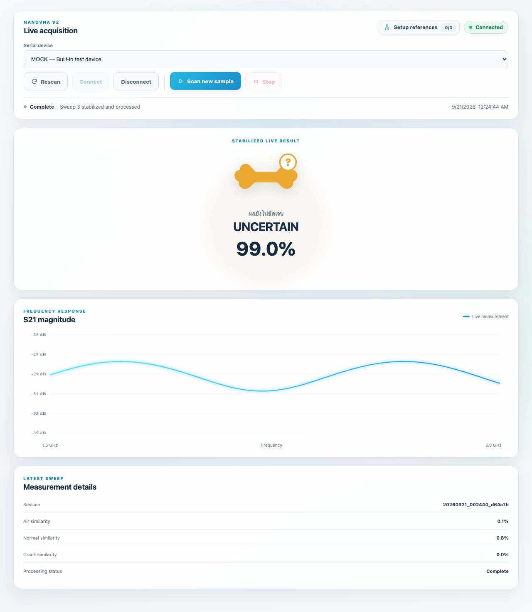

# Verified local test run — 2026-09-21

| Suite | Passed / collected | Failed / errors / skipped | Statement coverage |
|---|---:|---:|---:|
| BoneWave-AI Python | 41/41 | 0 / 0 / 0 | 94.55% (590/624) |
| Prototype Python | 6/6 | 0 / 0 / 0 | 55.85% (296/530) |
| Chromium browser E2E | 1/1 | 0 / 0 / 0 | Not measured |
| Total | 48/48 | 0 / 0 / 0 | Separate scopes |

`app/nanovna/device.py`: 85/85 executable statements covered (100%), up from 33/85 (38.82%). The backend total increased from 85.10% to 94.55%. These percentages describe statement execution with mocked serial transport, not branch coverage or hardware validation.

## Evidence

- Backend: [coverage](BoneWave-AI/coverage.txt), [JUnit](BoneWave-AI/junit.xml), [summary](BoneWave-AI/summary.json), [environment](BoneWave-AI/environment.txt)
- Prototype: [coverage](Prototype/coverage.txt), [JUnit](Prototype/junit.xml), [summary](Prototype/summary.json), [environment](Prototype/environment.txt)
- Browser: [JUnit](e2e/junit.xml), [completed scan screenshot](e2e/completed-scan.png), [trace ZIP](e2e/test_mock_scan_completes_and_disconnects.zip), [server log](e2e/server.log)
- [SHA-256 hashes of tested backend, browser assets and test source](source-sha256.json)

The mock scan rendered UNCERTAIN, matching the backend response. This is a software workflow test, not an accuracy evaluation. The test verifies 3 completed WebSocket sweeps, 3 persisted S2P files, UI control states, result rendering, disconnection, and absence of unhandled JavaScript page errors. The trace includes ordinary mouse clicks; no hidden classification shortcuts were used.

## Runtime and reproduction

Python 3.12.4 on macOS arm64, pytest 9.0.2, coverage 7.16.1, Playwright 1.63.0, Chromium 153.0.8010.12, Uvicorn 0.34.0 and websockets 14.1. Python tests used the existing project virtualenv plus temporary dependencies under `/tmp/bonewave-audit-deps`; E2E additionally used `/tmp/bonewave-browser-deps` and browser binaries under `/tmp/bonewave-playwright`. This was not a clean install of the component requirements. One dependency deprecation warning was emitted by Starlette/AnyIO in the backend tests. No product defect is inferred from that warning.

Run the commands in [the test plan](../../TEST_PLAN.md) and [main test README](../../README.md). Backend coverage scopes are `app` and `src,scripts` respectively. Browser execution is a separate job and is not included in Python coverage. The E2E fixture uses a disposable application copy and its own localhost server; it does not modify project measurement data.

During setup, sandbox restrictions initially blocked browser download and localhost binding; the final E2E run used approved execution outside those restrictions. An early fake-transport test helper was corrected before this final run. These setup/test-authoring failures are not counted as product bugs.

This is local evidence from an uncommitted working tree based on the revision recorded in each summary. It is not a claim that GitHub Actions has already run. The preserved JUnit timestamps are the actual timestamps of this run.
